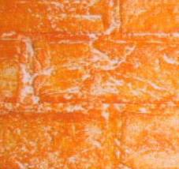
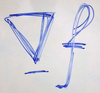
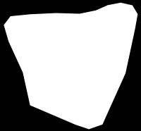
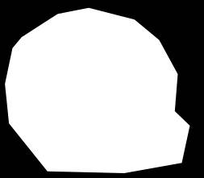

# Coordinates for Instant Image Cloning

Rust implementation of Coordinates for Instant Image Cloning

>Farbman, Zeev, et al. "Coordinates for instant image cloning." *ACM Transactions on Graphics (TOG)*. Vol. 28. No. 3. ACM, 2009.

## Toolchain

* rustc 1.40.0-nightly (e413dc36a 2019-10-14)

    nightly-x86_64-unknown-linux-gnu 

## Requirements

* At least CUDA version 8 to be installed

## Usage

```bash
coordinate-based image cloning 

USAGE:
    coordinate_based_image_cloning [OPTIONS]

FLAGS:
    -h, --help       Prints help information
    -V, --version    Prints version information

OPTIONS:
    -b, --background <BACKGROUND_IMAGE>    
    -f, --foreground <FOREGROUND_IMAGE>    
    -m, --mask <MASK>                      foreground and mask should be of the same size
    -o, --output <OUTPUT_PATH>              [default: cloned.png]
    -p, --parallel_type <PARALLEL_TYPE>     [default: thread]  [possible values: naive, thread, gpu]
    -x, --x_offset <X_OFFSET>               [default: 0]
    -y, --y_offset <Y_OFFSET>               [default: 0]
```

* Before using GPU, set the ```CUDA_LIBRARY_PATH```environment variable to the location of your CUDA libs

    for Ubuntu users, use  ```LIBRARY_PATH``` instead of ```CUDA_LIBRARY_PATH```

    ```bash
    export LIBRARY_PATH="/usr/local/cuda/lib64"
    ```

## Performance

| #cloned pixels | #boundary pixels | No parallel | Thread | GPU  |
| -------------- | ---------------- | ----------- | ------ | ---- |
|                |                  |             |        |      |

## Result

| Background          | Foreground          | Mask                    | Result                      |
| ------------------- | ------------------- | ----------------------- | --------------------------- |
|  |  |  |  |
|  |  |  |  |

