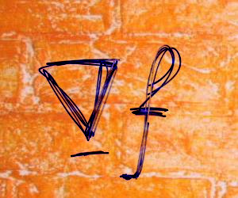

# Poisson Image Editing

Rust implementation of Poisson Image Editing

>Pérez, Patrick, Michel Gangnet, and Andrew Blake. "Poisson image editing." *ACM Transactions on graphics (TOG)* 22.3 (2003): 313-318.

## Toolchain

* nightly-x86_64-unknown-linux-gnu

## Usage

```bash
poisson image editing 

USAGE:
    poisson_image_editing [OPTIONS]

FLAGS:
    -h, --help       Prints help information
    -V, --version    Prints version information

OPTIONS:
    -b, --background <BACKGROUND_IMAGE>    
    -f, --foreground <FOREGROUND_IMAGE>    
    -m, --mask <MASK>                      foreground and mask should be of the same size
    -o, --output <OUTPUT_PATH>              [default: cloned.png]
    -t, --type <CLONE_TYPE>                 [default: mix_gradient]  [possible values: naive, mix_gradient]
    -x, --x_offset <X_OFFSET>               [default: 0]
    -y, --y_offset <Y_OFFSET>               [default: 0]
```

## Result

| Naive                     | MixGradient                             |
| ------------------------- | --------------------------------------- |
|  |  |

